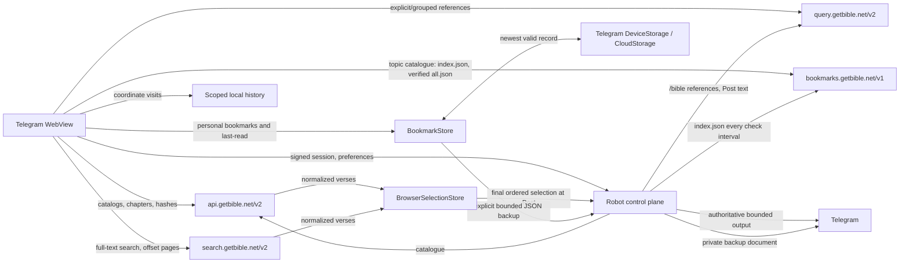

# Architecture

## System doctrine

GetBible Robot has two deliberately separate data planes:

1. **Mini App plane** — public, read-only GetBible API V2 data, browser-owned UI state, and compact user state reconciled with Telegram Mini App storage.
2. **Robot control plane** — Telegram authentication, preference compatibility, bounded bookmark backup transport, contribution intake, and final Telegram delivery.

Every Scripture read is a browser-to-GetBible operation: translation discovery, books, chapters, chapter text, and hashes from the Main API; explicit reference resolution from the Query API; full-text search from the Search API. The shared bookmark topic catalogue is read the same way, from the Bookmarks API. Robot proxies no Scripture, holds no search state, and ships no copy of the catalogue. Its own requests — `/bible` references, the authoritative text behind Post, the Telegram-native `/search` used when no Mini App is configured, and the periodic check of the Bookmarks API index that tells contributors their accepted changes are live — go to the same public APIs from the host.



No reader navigation, catalog load, chapter load, select, unselect, reorder, clear, or copy operation may call Robot.

## Module ownership

### Browser

| Module | Responsibility |
| --- | --- |
| `miniapp/lib/getbible-transport.js` | Fixed-origin (Main, Query, Search, and Bookmarks API), credential-free public HTTP transport with size bounds, stall-based deadlines, bounded retry, problem-document errors, and SHA-256 of fetched bytes |
| `miniapp/lib/getbible-api.js` | Main API, Query API, and Search API use cases, hash-aware retrieval, search query building, and public response orchestration |
| `miniapp/lib/getbible-model.js` | GetBible response normalization, search-result normalization with shared highlight analysis, and deterministic coordinate identities |
| `miniapp/lib/public-cache.js` | IndexedDB/memory cache, LRU bounds, atomic replacement, and invalidation |
| `miniapp/lib/selection-store.js` | Browser-owned ordered selection domain |
| `miniapp/lib/reading-history-store.js` | Bounded, durable, coordinate-only history in an authenticated user-scoped local key |
| `miniapp/lib/bookmark-store.js` | Canonical personal verse records, multi-topic assignment, colored topic management, and portable JSON import/export |
| `miniapp/lib/global-bookmark-source.js` | Cache-first loading of the Bookmarks API catalogue: daily `index.json` revalidation, `all.json` accepted only when its SHA-256 equals the index checksum, IndexedDB record with the checksum as validator, and network-required refresh for explicit pulls |
| `miniapp/lib/global-bookmark-catalog.js` | Global topic/verse catalogue built from the API document, default-topic and per-locale name definitions, and local-topic remapping |
| `miniapp/lib/global-bookmark-preferences.js` | Device-local global-topic visibility, per-link exclusions, canonical-to-local mapping, one-time default-topic seeding, and the coverage record behind the personal-to-global merge |
| `miniapp/lib/global-bookmark-device-storage.js` | Scoped timestamp reconciliation for global-topic preferences across localStorage and Telegram DeviceStorage, explicitly excluding CloudStorage |
| `miniapp/lib/telegram-bookmark-storage.js` | Aggregate-v3 timestamp reconciliation across localStorage, Telegram DeviceStorage, and Telegram CloudStorage, with compact cloud topic and recent-topic indexes |
| `miniapp/lib/bookmark-topic-sort.js` | Presentation-only alphabetical topic ordering without rewriting canonical storage order |
| `miniapp/lib/bible-canon.js` | Shared 66-book and per-book chapter bounds for contribution and catalogue coordinates |
| `miniapp/lib/instance-scope.js` | Deterministic non-secret namespace for state bound to one Robot API path |
| `miniapp/lib/api.js` | Robot session/preferences/Post, bookmark backup/restore, and contribution status/event-batch transport facade plus public API composition, including direct search |
| `miniapp/app.js` | UI orchestration and rendering only |

`BrowserSelectionStore` is the sole owner of temporary selected state. It enforces bounded capacity, coordinate deduplication, source-independent removal, explicit ordering, defensive snapshots, and final coordinate projection.

`MiniAppApi` delegates selection rules to the store. It does not implement selection identity, ordering, or display-state invariants itself.

### Robot

| Layer | Responsibility |
| --- | --- |
| Configuration and adapters | Validated settings, Telegram, Tornado, persistence, audit, and public ingress |
| Domain policies | Search options, rendering, rate limiting, preference models, launch/session ownership |
| Application services | Bounded Scripture service over the public Query and Search APIs, health, cleanup, posting, and idempotency |
| Delivery adapters | Telegram commands and Mini App HTTP translation |
| Composition root | `bot.py` constructs and wires all dependencies |

Dependencies point inward. Delivery adapters do not become a second Scripture repository or mutate store internals.

## Shared verse contract

Reader chapters and Search API results normalize to the same browser descriptor:

```text
selection_id
translation
reference
book_number
book_name
chapter
verse
text
terms
highlights
```

The canonical identity is:

```text
translation + book_number + chapter + verse
```

A reader verse and a search result carry the same deterministic direct selection identity, `gbd_<translation>_<book>_<chapter>_<verse>`, and the selection store keys by coordinate. This guarantees that:

- selecting in Search highlights the same verse in Reader;
- selecting in Reader highlights the same verse in Search;
- a second click from either source unselects it;
- one verse cannot appear twice under different transport tokens.

Display text and metadata are not posting authority.

## Browser Scripture plane

### Main API

`https://api.getbible.net/v2/` supplies:

- translation catalog and copyright metadata;
- translation book catalog;
- chapter maps;
- complete chapter text;
- translation, book, and chapter `.sha` values.

### Query API

`https://query.getbible.net/v2/` resolves explicit and grouped references. The browser uses it for `/bible <reference>` Mini App entry and grouped-reference work; the robot uses the same API from the host for the native `/bible` command and for the authoritative text behind Post.

### Search API

`https://search.getbible.net/v2/` answers full-text search: one `GET` per page carrying the reader's filters, answered with matches in authoritative order, chapter-grouped verse text, an exact total, `has_more`, and the corpus `sha`. The browser calls it directly for the Mini App's Search page; the robot calls it only for the Telegram-native `/search`. See [Search](SEARCH.md).

### Transport security

Public requests:

- use fixed HTTPS origins only;
- omit credentials, cookies, Telegram init data, and Robot tokens;
- reject redirects;
- use `no-referrer`;
- enforce request and response bounds;
- validate schema and requested coordinates.

The HTML CSP and Tornado response CSP must contain the same four public origins.

## Cache integrity

Identity-free public data is cached under the `public:v2:` namespace. Telegram data, sessions, preferences, search results, selections, and posting state are never persisted there.

The cache enforces:

- bounded record count;
- bounded total estimated bytes;
- bounded per-record bytes;
- least-recently-used eviction;
- in-flight request coalescing;
- exact-scope hash metadata;
- at-least-weekly revalidation;
- descendant invalidation;
- atomic replacement.

A chapter is accepted only when the pre-read and post-read hashes match, SHA-1 over the exact response bytes matches that hash, and bounded schema/coordinate validation succeeds. A failed refresh never overwrites a valid record.

## Robot control plane

Robot owns:

- Telegram-signed `initData` verification;
- owner-bound launch exchange;
- bounded opaque sessions with a ninety-day default absolute lifetime;
- reader preferences;
- Telegram-native `/bible` and `/search` delivery through the public Query
  and Search APIs when no Mini App is configured;
- validation and private-chat delivery/retrieval of explicitly requested,
  bounded bookmark backup documents;
- final Post authorization, idempotency, authoritative resolution, rendering, and Telegram delivery;
- cleanup, audit, health, and operational limits.

A public API error never invalidates a Telegram session. A Search API failure affects search only. Browser selection remains usable while Robot is temporarily unavailable.

## Selection lifecycle

1. A chapter or search result registers normalized verses with `BrowserSelectionStore`.
2. Select/unselect/reorder/clear update browser memory synchronously.
3. UI styling, `aria-pressed`, range boundaries, counters, and clipboard output derive from a defensive store snapshot.
4. No Robot mutation occurs during these operations.
5. Post captures one immutable ordered snapshot.
6. Robot validates and authoritatively resolves the final selection before Telegram delivery.
7. Failure preserves the browser snapshot; success clears it.

The active WebView selection is intentionally ephemeral and identity-free outside that session. Reader content remains durable through the public cache, not through Robot session memory.

## Reading history lifecycle

Successful chapter opens and successful verse selections record a normalized
coordinate in `ReadingHistoryStore`. Chapter visits share book and chapter
identity even when their target verse or translation changes. Verse selections
share full book, chapter, and verse identity across translations, and an exact
coordinate also coalesces across event kinds. A revisit refreshes metadata and
visit time, preserves its local identifier, and moves it to the front instead
of adding a duplicate. Entries retain only that identifier, event kind,
translation, reference, book name/number, chapter, verse, and visit time. They
never retain verse bodies, Telegram identity, launch data, or Robot credentials.

History is unique and newest-first, bounded to 1,000 entries, and stored under
a versioned, authenticated user-scoped `localStorage` key. It survives WebView
sessions on that browser until the user clears it or browser data is removed.
Restoration compacts legacy duplicate coordinates newest-first. The History
view resolves initial and near-viewport verse excerpts through one
concurrency-bounded, display-only public chapter path shared with global
Bookmarks. Rows render independently as their chapters resolve, cancelled
views skip unshared queued work, and a missing coordinate receives a localized
unavailable state. Transient chapter failures render a localized request state
and retry after the browser reconnects. The view does not persist those bodies
or register them as selectable authority.
Reopening an entry uses its exact coordinate with the translation that is
currently selected. Individual removal and full reset are local browser
operations and issue no Robot or Telegram storage request. Storage rejection
falls back to memory for the active page.

## Bookmarks and last-read lifecycle

`BookmarkStore` owns at most 800 personal verse records, each unique by
canonical book/chapter/verse across translations. A record may belong to
multiple colored topics without consuming another verse slot. Reassigning the
same coordinate updates that record; assigning an existing topic is a no-op.
The domain permits topic add/rename/recolor/removal and warns before topic
removal also removes its personal verse assignments. Global topic identity
and English names remain stable storage metadata, while display names come
from the catalogue's per-locale names with English fallback and are read-only;
global colors remain editable. New stores start with no topics; the
catalogue's default topics are seeded once per scope when the catalogue first
loads. Custom topic names remain editable. The UI creates topics from the
plus-card after the alphabetical list and edits names/colors in topic detail;
it has no second topic editor. Removing a global topic is a user-local catalogue
choice, and **Add all** restores its reviewed definition while preserving
custom topics and personal bookmarks. Bookmarks represent the complete verse;
text ranges and notes from a compatible imported document are not made active
bookmark state.

Personal aggregate version 3 is written immediately to scoped browser
`localStorage`. `TelegramBookmarkStorage` reconciles the newest valid
timestamped aggregate with Telegram `DeviceStorage` and `CloudStorage` and
mirrors the winner back to available stores. Cloud bookmark records replace
topic identifiers with compact indexes into the synchronized topic manifest;
the full identifiers and the clearable recently-used order for every current
topic are reconstructed during reconciliation. Stable item
wrappers and a metadata fingerprint avoid rewriting unchanged values, preserve
metadata-last atomicity, and allow bounded automatic retry after a partial
write. A compact
last-read record follows the same local/device/cloud pattern; clearing it writes
a newer coordinate-free tombstone so a stale remote value cannot reappear.
Existing Robot reader preferences remain a compatibility and availability
fallback. No history entry, selection, chapter body, global catalog, global
exclusion, or public-cache record is sent through the personal adapter.

The global catalogue is the public Bookmarks API at
`https://bookmarks.getbible.net/v1`. `global-bookmark-source.js` loads it
cache-first: a cached document younger than a day is used as is; otherwise
`index.json` is read and, when its checksum matches the cached validator, the
cache is marked checked; when it differs, `all.json` is downloaded, accepted
only if its SHA-256 equals the index checksum, normalised, and stored in the
IndexedDB public cache with that checksum as validator. An explicit **Add all**
or per-topic load requires the network. When nothing can be loaded the surface
reports global topics as unavailable until online; no bundled list exists.
Personal and global rows share one topic list, with global
rows marked
**G**. Global rows hydrate display-only verse text for the active translation
through the bounded public chapter data plane. Compact all-catalog add/remove
controls appear before topic search; per-topic add/remove and per-link hiding
remain available. A hashed-account-scoped adapter reconciles timestamped
visibility, exclusions, and canonical-to-local mapping between localStorage
and Telegram `DeviceStorage`, allowing Telegram Desktop to restore the state
when its WebView storage is discarded. `CloudStorage` is deliberately excluded,
so this state remains device-local. Loading one topic or the complete catalog
also resets the relevant exclusions without creating duplicates. Global links
never become personal records and never enter CloudStorage or backup documents.
A personal bookmark whose coordinate an enabled global topic also links is
recorded as covered on every successful network refresh; once that coverage
has been stable for a day, the next network-verified load removes the personal
row, the global row stands in for it, and the status line reports how many
were merged. A cache-only or unavailable catalogue never removes anything.
Approved contributors synchronize
through an explicit **Sync now**: the browser converts the current personal
topic/assignment state into bounded idempotent contribution events with
deterministic content-derived IDs, appends its queued explicit global
add/remove intents, and posts them to the same-origin
`POST /api/v1/contributions/events` endpoint in sequential
session-authenticated batches of at most 50 events. Every batch body also
carries the short-lived `contribution_token` that only approved contributors
receive inside JSON payloads — alongside the session bearer, never as a
header — and the drip draws on a dedicated contribution rate budget
(`CONTRIBUTION_RATE_CAPACITY`, `CONTRIBUTION_RATE_REFILL_PER_SECOND`)
separate from the public search limits. Contributor authority and
disclosure are rechecked in the durable SQLite store on every batch. A
redelivered event replays idempotently per contributor and `client_event_id`;
a reused ID with different content fails closed. Every response returns the
batch receipt with the complete contributor status and the accepted-ledger
revision/checksum, so the final batch settles the panel in one round trip.
Contributor state never enters Telegram storage, and a failed request never
rolls back the personal bookmark mutation.

Acceptance runs outside the browser. A maintainer reviews applications,
topics and verses; final acceptance saves the existing ledger and invokes the
API publisher. `bookmark_sources` (layer 0) validates the builder's source
contract; `contribution_publication` (layer 1) composes that contract with the
existing durable store and bounded GitHub/OpenAI adapters. The CLI helper
owns optional configuration and the native privilege handoff.

A separate private receipt/translation journal keeps the moderation schema
unchanged. The first publication preserves accepted legacy ledger data; later
ones consume per-event receipts rather than replaying old operations. New-topic
translation is optional and schema-validated. All changed topics, links and
locales enter one non-force commit on the builder's default branch through
HTTPS; no local Git or contribution branch/PR is needed. The builder's push
workflow generates the Bookmarks API. Robot's
`watch-bookmark-catalog` task reads `index.json` every
`BOOKMARK_CATALOG_CHECK_INTERVAL_SECONDS`, fetches and verifies the catalogue
when the version or checksum moved, records it, marks the applied events it
now contains as live, and queues one private "contributions live" notice per
contributor. A contributed topic is reported as published only once it has
been seen in that catalogue, so the Mini App's **P** marker becomes **G** on
the next status refresh, never on acceptance alone.

The user may download or import the same bounded personal JSON locally. New
backup documents are version 4 and carry each record's topic assignments as
bounded `colorIndexes` into the document's color array. They store `bookName`
instead of a redundant formatted reference, keeping even the worst-case
800-record, 100-topic UTF-8 document below 4 MiB when pretty-printed. Version 1,
2, and 3 documents remain importable. **Back up to
chat** submits the document through an authenticated, idempotent Robot endpoint;
Robot validates and canonicalizes it and sends it to that user's private bot
chat with an owner-bound permanent Restore callback. Pressing the callback in
the private owner chat validates the Telegram document metadata and creates a
fresh, short-lived, one-time Mini App launch. The Mini App retrieves the file,
asks before merging, flushes the merged state, and explicitly acknowledges the
restore reference. The chat document remains the durable recovery artifact.
Backup bodies are never written to Robot database/session state or logs; a
restore launch retains only bounded Telegram file metadata until acknowledgement
or expiry.

## Search

The Mini App searches `https://search.getbible.net/v2` directly from the browser, over the same fixed-origin transport as chapters and references. Robot serves no search endpoint and keeps no search state; search defaults persist through the ordinary preferences endpoint only.

The browser supplies a query and narrowing filters; the Search API derives the matching strategy from the text of the translation and of the query. No layer here inspects a query to choose a match mode, and no per-language branch exists in this repository. A page is 50 matches, requested automatically while the reader scrolls (an IntersectionObserver on the foot of the list, rooted at the scrolling view, with a scroll-measured fallback) and advanced by `offset + returned` while `has_more` is true, up to the API's offset ceiling of 10 000; a changed corpus `sha` restarts the search from offset zero rather than combining two corpora; the summary shows the API's exact total and the foot of the list reports when every match is loaded or the ceiling was reached. A failed page pauses automatic loading until an explicit retry. Matches are normalized into the same verse descriptor as reader chapters, with the same direct selection identity, before registration in `BrowserSelectionStore`. Display text from a search is never posting authority.

The Telegram-native `/search` used when no Mini App is configured is served by the robot's thin client to the same API on its own executor, semaphore, per-request deadline (`SEARCH_TIMEOUT`), response bound (`SEARCH_MAX_RESPONSE_BYTES`), page size (`SEARCH_RESULT_LIMIT`, clamped to the API's 100), and circuit, so a slow upstream cannot consume a direct-reference permit. The robot downloads no corpus, builds no index, and runs no prewarm. See [Search](SEARCH.md).

## Posting and trust

The browser is untrusted for final Telegram output. It may choose coordinates and ordering, but it cannot choose authoritative Scripture text.

Final Post must:

1. validate the bounded ordered selection;
2. reject malformed, duplicate, or unavailable coordinates;
3. reconstruct canonical references from authoritative data;
4. obtain authoritative Scripture without trusting browser text;
5. bind idempotency to the final ordered selection;
6. render escaped, UTF-16-aware, message-count-bounded Telegram output;
7. record the external outcome before clearing selection state.

Known partial sends are rolled back best-effort. Ambiguous outcomes remain locked rather than being retried under a new key.

## Session and concurrency model

Launch tokens and sessions are owner-bound, capacity-bounded, and independent.
The authenticated Mini App session has a ninety-day default absolute lifetime
and is not extended indefinitely by activity. This keeps a launch usable for a
whole season of reading and contributing while preserving a definite
authentication boundary, and a fresh Telegram launch always re-authenticates
with fresh signed `initData` regardless of the stored lifetime.

Fresh Telegram `initData` is signature-, age-, user-, chat-, and launch-checked
only at the initial session exchange. Robot then uses its own opaque session
bearer for ordinary protected requests. **Sync now** uses that same opaque
session bearer for its sequential bounded event batches on the existing Mini
App listener, and a `429` paces the drip through the server's `Retry-After`.
No WebSocket or extra port participates in this control plane.

Browser selection mutations are synchronous and single-threaded. Search pagination uses latest-request coordination so stale responses cannot overwrite current state, and restarts from offset zero when the corpus `sha` changes between pages; scroll-driven page requests run one at a time, advance monotonically, and never retry a failure on their own. Preference writes are serialized per user. Final posting is serialized and idempotent.

Bookmark writes are synchronous locally and asynchronously coalesced for
Telegram storage. Timestamp reconciliation makes startup deterministic when
local, device, and cloud copies differ. Bookmark chat backup is serialized and
idempotent per authenticated session; restore references are single-launch and
explicitly consumed only after a confirmed merge has persisted.

Synchronous upstream work — the robot's own Main, Query, and Search API requests — runs in fixed executors. Timeouts do not release capacity until the underlying future exits, preventing cancellation from turning into an unbounded queue.

## Failure isolation

| Failure | Impact |
| --- | --- |
| Main API unavailable | uncached reading only |
| Query API unavailable | explicit/grouped reference resolution only |
| Search API unavailable | search only |
| Bookmarks API unavailable | global topics come from the IndexedDB copy; with nothing cached the surface reports them unavailable until online; no personal bookmark is merged; the robot's watcher logs a warning and retries next interval |
| Robot temporarily unavailable | authentication/preferences/Post only; local selection remains and public reads, including search and the topic catalogue, continue |
| Telegram Mini App storage unavailable | local bookmark and last-read copies continue; UI reports degraded sync |
| Browser local storage unavailable | history falls back to memory; Telegram bookmark storage can still persist when supported |
| Bookmark chat backup unavailable | live bookmarks remain unchanged; local JSON export remains available |
| Contribution sync unavailable | personal bookmarks remain authoritative; the same idempotent event batches can be resent |
| Invalid public response | rejected without cache replacement |
| Failed Post | ordered browser selection preserved |
| Expired Robot session | protected operations fail closed; public cached data remains identity-free |

## Deployment

HTML, modules, server code, and documentation must deploy from one validated commit. Every packaged client file is served with `no-store`, and the shell names its script and stylesheet below `build/<fingerprint>/`, where the fingerprint is a content hash of the complete packaged client tree; relative imports resolve below the same prefix. A Telegram WebView that keeps cache entries without revalidating them therefore never finds a previous deployment's module at the address a current shell asks for, so it can never combine incompatible generations. A classic `boot.js` watchdog turns a module graph that still fails to load into the ordinary retry gate instead of an endless opening spinner.

Host deployment uses separate private listeners for health, webhook delivery, and Mini App HTTPS proxying. Health stays on loopback; a webhook or Mini App behind a remote proxy binds a specific bot-host IP and is firewall-restricted to that proxy. Docker deployments expose application listeners only to private ingress. Polling and the Mini App are independent and may run together.

## Observability and privacy

Structured events contain route, status, duration, configured instance, and policy-controlled pseudonymous identity. They never contain tokens, Telegram init data, verse bodies, repository payloads, or browser cache content.

The IndexedDB public cache contains public Scripture only. Temporary selections
remain in browser memory for the active WebView. Coordinate-only history uses a
separate user-scoped browser `localStorage` key and never enters Telegram or
Robot storage. Bookmark topics, whole-verse bookmarks, and compact last-read
coordinates use separate scoped local/Telegram storage; they never enter the
public cache. Robot retains its restricted reader preference for compatibility
but never retains bookmark backup bodies. Structured logs exclude bookmark
documents as well as Scripture bodies and credentials.

## Release gate

A release is production-ready only when permanent CI and CodeQL pass on the exact PR head and prove:

- Python 3.10, 3.11, 3.12, 3.13, and 3.14;
- production container build and smoke test;
- lint, strict typing, branch coverage, dependency audit, secret scan, and systemd verification;
- public Main API, Query API, Search API, and Bookmarks API routing with no Robot content proxy;
- CSP parity and fixed-origin enforcement;
- hash verification, weekly revalidation, invalidation, bounds, and atomic cache replacement;
- browser selection add/remove/reorder/clear and defensive snapshots;
- reader/search coordinate interchangeability;
- graphical highlight and second-click unselect in real Chromium;
- no Robot selection mutation before Post;
- failed Post preserves selection and successful Post clears it;
- durable scoped history remains local, unique, bounded, and coordinate-only;
- the 800-record bookmark bound, canonical deduplication, multi-topic
  assignments, default-topic restoration, aggregate-v3 reconciliation, bounded
  recent-topic metadata, and compact CloudStorage topic indexes;
- the unified global/personal list, **G** marker, compact all-catalog controls,
  scoped local/DeviceStorage restoration of global visibility and exclusions,
  and per-link/per-topic/all-catalog reset without CloudStorage or personal sync;
- approved-contributor disclosure and per-batch authority rechecks, bounded
  idempotent event batches, per-event replay without duplication, rate-limit
  pacing, and global-removal capture;
- the Bookmarks API catalogue: cache-first loading, daily `index.json`
  revalidation, rejection of an `all.json` whose SHA-256 differs from the
  index, network-required explicit pulls, one-time default-topic seeding, and
  personal-to-global merge only after a day of network-verified coverage;
- publication through an atomic API commit on `getbible/v1_bookmark_builder`, the
  catalogue watcher, and one "contributions live" notice per contributor;
- bounded JSON download/import plus owner-bound private-chat backup, fresh
  one-time restore launch, compact v4 `colorIndexes` plus v1/v2/v3 import,
  persistence-before-acknowledgement, and absence of global links or backup
  bodies from Robot persistence and logs;
- authoritative idempotent Telegram delivery.
