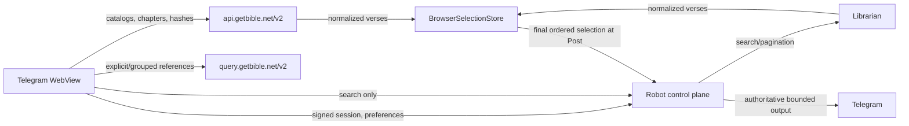

# Architecture

## System doctrine

GetBible Robot has two deliberately separate data planes:

1. **Browser Scripture plane** — public, read-only GetBible API V2 data and temporary UI state.
2. **Robot control plane** — Telegram authentication, preferences, Librarian search, and final Telegram delivery.

Only full-text search and search pagination use Librarian. Translation discovery, books, chapters, chapter text, hashes, and explicit reference resolution are browser-to-GetBible API operations.



No reader navigation, catalog load, chapter load, select, unselect, reorder, clear, or copy operation may call Robot.

## Module ownership

### Browser

| Module | Responsibility |
| --- | --- |
| `miniapp/lib/getbible-transport.js` | Fixed-origin, credential-free public HTTP transport with bounds and timeout policy |
| `miniapp/lib/getbible-api.js` | Main API and Query API use cases, hash-aware retrieval, and public response orchestration |
| `miniapp/lib/getbible-model.js` | GetBible response normalization and deterministic coordinate identities |
| `miniapp/lib/public-cache.js` | IndexedDB/memory cache, LRU bounds, atomic replacement, and invalidation |
| `miniapp/lib/selection-store.js` | Browser-owned ordered selection domain |
| `miniapp/lib/api.js` | Robot session/search/preferences/Post transport facade and public API composition |
| `miniapp/app.js` | UI orchestration and rendering only |

`BrowserSelectionStore` is the sole owner of temporary selected state. It enforces bounded capacity, coordinate deduplication, source-independent removal, explicit ordering, defensive snapshots, and final coordinate projection.

`MiniAppApi` delegates selection rules to the store. It does not implement selection identity, ordering, or display-state invariants itself.

### Robot

| Layer | Responsibility |
| --- | --- |
| Configuration and adapters | Validated settings, Telegram, Tornado, persistence, audit, and public ingress |
| Domain policies | Search options, rendering, rate limiting, preference models, launch/session ownership |
| Application services | Bounded Librarian search, health, cleanup, posting, and idempotency |
| Delivery adapters | Telegram commands and Mini App HTTP translation |
| Composition root | `bot.py` constructs and wires all dependencies |

Dependencies point inward. Delivery adapters do not become a second Scripture repository or mutate store internals.

## Shared verse contract

Reader chapters and Librarian search results normalize to the same browser descriptor:

```text
selection_id
translation
reference
book_number
book_name
chapter
verse
text
terms
highlights
```

The canonical identity is:

```text
translation + book_number + chapter + verse
```

A deterministic reader ID and an opaque Librarian result token may identify the same coordinate. The selection store treats them as one verse. This guarantees that:

- selecting in Search highlights the same verse in Reader;
- selecting in Reader highlights the same verse in Search;
- a second click from either source unselects it;
- one verse cannot appear twice under different transport tokens.

Display text and metadata are not posting authority.

## Browser Scripture plane

### Main API

`https://api.getbible.net/v2/` supplies:

- translation catalog and copyright metadata;
- translation book catalog;
- chapter maps;
- complete chapter text;
- translation, book, and chapter `.sha` values.

### Query API

`https://query.getbible.net/v2/` resolves explicit and grouped references. It is used for `/bible <reference>` Mini App entry and grouped-reference work that does not require full-text corpus search.

### Transport security

Public requests:

- use fixed HTTPS origins only;
- omit credentials, cookies, Telegram init data, and Robot tokens;
- reject redirects;
- use `no-referrer`;
- enforce request and response bounds;
- validate schema and requested coordinates.

The HTML CSP and Tornado response CSP must contain the same two public origins.

## Cache integrity

Identity-free public data is cached under the `public:v2:` namespace. Telegram data, sessions, preferences, search results, selections, and posting state are never persisted there.

The cache enforces:

- bounded record count;
- bounded total estimated bytes;
- bounded per-record bytes;
- least-recently-used eviction;
- in-flight request coalescing;
- exact-scope hash metadata;
- at-least-weekly revalidation;
- descendant invalidation;
- atomic replacement.

A chapter is accepted only when the pre-read and post-read hashes match, SHA-1 over the exact response bytes matches that hash, and bounded schema/coordinate validation succeeds. A failed refresh never overwrites a valid record.

## Robot control plane

Robot owns:

- Telegram-signed `initData` verification;
- owner-bound launch exchange;
- short-lived opaque sessions;
- reader preferences;
- full-text search and pagination through Librarian;
- final Post authorization, idempotency, authoritative resolution, rendering, and Telegram delivery;
- cleanup, audit, health, and operational limits.

A public API error never invalidates a Telegram session. A Librarian failure affects search only. Browser selection remains usable while Robot is temporarily unavailable.

## Selection lifecycle

1. A chapter or search result registers normalized verses with `BrowserSelectionStore`.
2. Select/unselect/reorder/clear update browser memory synchronously.
3. UI styling, `aria-pressed`, range boundaries, counters, and clipboard output derive from a defensive store snapshot.
4. No Robot mutation occurs during these operations.
5. Post captures one immutable ordered snapshot.
6. Robot validates and authoritatively resolves the final selection before Telegram delivery.
7. Failure preserves the browser snapshot; success clears it.

The active WebView selection is intentionally ephemeral and identity-free outside that session. Reader content remains durable through the public cache, not through Robot session memory.

## Search

Search is the only Mini App content operation backed by Librarian. It uses a separate bounded executor, semaphore, timeout, and circuit state from reference delivery so expensive corpus work cannot consume every direct-reference permit.

Search responses are bounded and normalized before reaching the browser. Search tokens are not selection identity and are not trusted for final text.

The robot supplies a query and narrowing filters; Librarian derives the matching
strategy from the text of the translation and of the query. No layer here
inspects a query to choose a match mode, and no per-language branch exists in
this repository. Corpora and their indexes live in a Librarian registry keyed by
repository, translation and source SHA, shared by every client object in the
process, so the parse-and-analyse cost is paid once per translation version.
Index construction is bounded separately from a request deadline because one
build serves every later search. See [Search](SEARCH.md).

## Posting and trust

The browser is untrusted for final Telegram output. It may choose coordinates and ordering, but it cannot choose authoritative Scripture text.

Final Post must:

1. validate the bounded ordered selection;
2. reject malformed, duplicate, or unavailable coordinates;
3. reconstruct canonical references from authoritative data;
4. obtain authoritative Scripture without trusting browser text;
5. bind idempotency to the final ordered selection;
6. render escaped, UTF-16-aware, message-count-bounded Telegram output;
7. record the external outcome before clearing selection state.

Known partial sends are rolled back best-effort. Ambiguous outcomes remain locked rather than being retried under a new key.

## Session and concurrency model

Launch tokens and sessions are owner-bound, short-lived, capacity-bounded, and independent. Telegram session lifetime is absolute and is not extended indefinitely by activity.

Browser selection mutations are synchronous and single-threaded. Search pagination uses latest-request coordination so stale responses cannot overwrite current state. Preference writes are serialized per user. Final posting is serialized and idempotent.

Synchronous Librarian work runs in fixed executors. Timeouts do not release capacity until the underlying future exits, preventing cancellation from turning into an unbounded queue.

## Failure isolation

| Failure | Impact |
| --- | --- |
| Main API unavailable | uncached reading only |
| Query API unavailable | explicit/grouped reference resolution only |
| Librarian unavailable | search only |
| Robot temporarily unavailable | authentication/search/preferences/Post only; local selection remains |
| Invalid public response | rejected without cache replacement |
| Failed Post | ordered browser selection preserved |
| Expired Robot session | protected operations fail closed; public cached data remains identity-free |

## Deployment

HTML, modules, server code, and documentation must deploy from one validated commit. `index.html` is served with `no-store`; static assets revalidate through ETags. This prevents a Telegram WebView from combining incompatible generations.

Host deployment uses separate loopback listeners for health, webhook delivery, and Mini App HTTPS proxying. Docker deployments expose the Mini App only to private ingress. Polling and the Mini App are independent and may run together.

## Observability and privacy

Structured events contain route, status, duration, configured instance, and policy-controlled pseudonymous identity. They never contain tokens, Telegram init data, verse bodies, repository payloads, or browser cache content.

The browser persistent cache contains public Scripture only. User translation and reader coordinates remain in the restricted preference store. Temporary selections remain in browser memory and expire with the WebView.

## Release gate

A release is production-ready only when permanent CI and CodeQL pass on the exact PR head and prove:

- Python 3.10, 3.11, and 3.12;
- production container build and smoke test;
- lint, strict typing, branch coverage, dependency audit, secret scan, and systemd verification;
- public Main API and Query API routing with no Robot content proxy;
- CSP parity and fixed-origin enforcement;
- hash verification, weekly revalidation, invalidation, bounds, and atomic cache replacement;
- browser selection add/remove/reorder/clear and defensive snapshots;
- reader/search coordinate interchangeability;
- graphical highlight and second-click unselect in real Chromium;
- no Robot selection mutation before Post;
- failed Post preserves selection and successful Post clears it;
- authoritative idempotent Telegram delivery.
