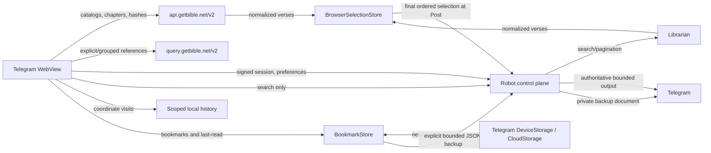

# Architecture

## System doctrine

GetBible Robot has two deliberately separate data planes:

1. **Mini App plane** — public, read-only GetBible API V2 data, browser-owned UI state, and compact user state reconciled with Telegram Mini App storage.
2. **Robot control plane** — Telegram authentication, preference compatibility, Librarian search, bounded bookmark backup transport, and final Telegram delivery.

Only full-text search and search pagination use Librarian. Translation discovery, books, chapters, chapter text, hashes, and explicit reference resolution are browser-to-GetBible API operations.



No reader navigation, catalog load, chapter load, select, unselect, reorder, clear, or copy operation may call Robot.

## Module ownership

### Browser

| Module | Responsibility |
| --- | --- |
| `miniapp/lib/getbible-transport.js` | Fixed-origin, credential-free public HTTP transport with size bounds, stall-based deadlines, and bounded retry |
| `miniapp/lib/getbible-api.js` | Main API and Query API use cases, hash-aware retrieval, and public response orchestration |
| `miniapp/lib/getbible-model.js` | GetBible response normalization and deterministic coordinate identities |
| `miniapp/lib/public-cache.js` | IndexedDB/memory cache, LRU bounds, atomic replacement, and invalidation |
| `miniapp/lib/selection-store.js` | Browser-owned ordered selection domain |
| `miniapp/lib/reading-history-store.js` | Bounded, durable, coordinate-only history in an authenticated user-scoped local key |
| `miniapp/lib/bookmark-store.js` | Canonical whole-verse bookmarks, colored topic management, and portable JSON import/export |
| `miniapp/lib/telegram-bookmark-storage.js` | Timestamp reconciliation across localStorage, Telegram DeviceStorage, and Telegram CloudStorage for bookmarks and compact last-read |
| `miniapp/lib/api.js` | Robot session/search/preferences/Post and bookmark backup/restore transport facade plus public API composition |
| `miniapp/app.js` | UI orchestration and rendering only |

`BrowserSelectionStore` is the sole owner of temporary selected state. It enforces bounded capacity, coordinate deduplication, source-independent removal, explicit ordering, defensive snapshots, and final coordinate projection.

`MiniAppApi` delegates selection rules to the store. It does not implement selection identity, ordering, or display-state invariants itself.

### Robot

| Layer | Responsibility |
| --- | --- |
| Configuration and adapters | Validated settings, Telegram, Tornado, persistence, audit, and public ingress |
| Domain policies | Search options, rendering, rate limiting, preference models, launch/session ownership |
| Application services | Bounded Librarian search, health, cleanup, posting, and idempotency |
| Delivery adapters | Telegram commands and Mini App HTTP translation |
| Composition root | `bot.py` constructs and wires all dependencies |

Dependencies point inward. Delivery adapters do not become a second Scripture repository or mutate store internals.

## Shared verse contract

Reader chapters and Librarian search results normalize to the same browser descriptor:

```text
selection_id
translation
reference
book_number
book_name
chapter
verse
text
terms
highlights
```

The canonical identity is:

```text
translation + book_number + chapter + verse
```

A deterministic reader ID and an opaque Librarian result token may identify the same coordinate. The selection store treats them as one verse. This guarantees that:

- selecting in Search highlights the same verse in Reader;
- selecting in Reader highlights the same verse in Search;
- a second click from either source unselects it;
- one verse cannot appear twice under different transport tokens.

Display text and metadata are not posting authority.

## Browser Scripture plane

### Main API

`https://api.getbible.net/v2/` supplies:

- translation catalog and copyright metadata;
- translation book catalog;
- chapter maps;
- complete chapter text;
- translation, book, and chapter `.sha` values.

### Query API

`https://query.getbible.net/v2/` resolves explicit and grouped references. It is used for `/bible <reference>` Mini App entry and grouped-reference work that does not require full-text corpus search.

### Transport security

Public requests:

- use fixed HTTPS origins only;
- omit credentials, cookies, Telegram init data, and Robot tokens;
- reject redirects;
- use `no-referrer`;
- enforce request and response bounds;
- validate schema and requested coordinates.

The HTML CSP and Tornado response CSP must contain the same two public origins.

## Cache integrity

Identity-free public data is cached under the `public:v2:` namespace. Telegram data, sessions, preferences, search results, selections, and posting state are never persisted there.

The cache enforces:

- bounded record count;
- bounded total estimated bytes;
- bounded per-record bytes;
- least-recently-used eviction;
- in-flight request coalescing;
- exact-scope hash metadata;
- at-least-weekly revalidation;
- descendant invalidation;
- atomic replacement.

A chapter is accepted only when the pre-read and post-read hashes match, SHA-1 over the exact response bytes matches that hash, and bounded schema/coordinate validation succeeds. A failed refresh never overwrites a valid record.

## Robot control plane

Robot owns:

- Telegram-signed `initData` verification;
- owner-bound launch exchange;
- bounded opaque sessions with a three-hour default absolute lifetime;
- reader preferences;
- full-text search and pagination through Librarian;
- validation and private-chat delivery/retrieval of explicitly requested,
  bounded bookmark backup documents;
- final Post authorization, idempotency, authoritative resolution, rendering, and Telegram delivery;
- cleanup, audit, health, and operational limits.

A public API error never invalidates a Telegram session. A Librarian failure affects search only. Browser selection remains usable while Robot is temporarily unavailable.

## Selection lifecycle

1. A chapter or search result registers normalized verses with `BrowserSelectionStore`.
2. Select/unselect/reorder/clear update browser memory synchronously.
3. UI styling, `aria-pressed`, range boundaries, counters, and clipboard output derive from a defensive store snapshot.
4. No Robot mutation occurs during these operations.
5. Post captures one immutable ordered snapshot.
6. Robot validates and authoritatively resolves the final selection before Telegram delivery.
7. Failure preserves the browser snapshot; success clears it.

The active WebView selection is intentionally ephemeral and identity-free outside that session. Reader content remains durable through the public cache, not through Robot session memory.

## Reading history lifecycle

Successful chapter opens and successful verse selections record a normalized
coordinate in `ReadingHistoryStore`. Chapter visits share translation, book,
and chapter identity even when their target verse changes. Verse selections
share full translation, book, chapter, and verse identity, and an exact
coordinate also coalesces across event kinds. A revisit refreshes metadata and
visit time, preserves its local identifier, and moves it to the front instead
of adding a duplicate. Entries retain only that identifier, event kind,
translation, reference, book name/number, chapter, verse, and visit time. They
never retain verse bodies, Telegram identity, launch data, or Robot credentials.

History is unique and newest-first, bounded to 1,000 entries, and stored under
a versioned, authenticated user-scoped `localStorage` key. It survives WebView
sessions on that browser until the user clears it or browser data is removed.
Restoration compacts legacy duplicate coordinates newest-first. Reopening an
entry restores both its translation and exact coordinate. Individual removal
and full reset are local browser operations and issue no Robot or Telegram
storage request. Storage rejection falls back to memory for the active page.

## Bookmarks and last-read lifecycle

`BookmarkStore` owns one bookmark per canonical book/chapter/verse across
translations. Selecting a topic replaces that verse's previous topic and
display translation instead of creating a duplicate. The domain has bounded
topic and bookmark counts, ships a fixed colored topic catalog, permits topic
add/rename/recolor/removal, and exports or merges a bounded, versioned JSON
document. Bookmarks represent the complete verse; text ranges and notes from a
compatible imported document are not made active bookmark state.

The synchronous aggregate is written immediately to scoped browser
`localStorage`. `TelegramBookmarkStorage` then reconciles the newest valid
timestamped aggregate with Telegram `DeviceStorage` and `CloudStorage` when
those APIs are available, and mirrors the winner back to available stores. A
compact last-read record containing only translation, book, chapter, verse,
version, and update time follows the same local/device/cloud pattern; clearing
it writes a newer coordinate-free tombstone so a stale remote value cannot
reappear. Existing Robot reader preferences remain a compatibility and
availability fallback.
No history entry, selection, chapter body, catalog, or public-cache record is
sent through this adapter.

The user may download or import the same bounded JSON locally. **Back up to
chat** submits it through an authenticated, idempotent Robot endpoint; Robot
validates and canonicalizes the document and sends it to that user's private
bot chat with an owner-bound permanent Restore callback. Pressing the callback
in the private owner chat validates the Telegram document metadata and creates
a fresh, short-lived, one-time Mini App launch. The Mini App retrieves the file
through that launch, asks before merging, flushes the merged state to an
available persistent store, and then explicitly acknowledges the restore
reference. The chat document remains the durable recovery artifact. Backup
bodies are never written to Robot database/session state or logs; a restore
launch retains only bounded Telegram file metadata until acknowledgement or
expiry.

## Search

Search is the only Mini App content operation backed by Librarian. It uses a separate bounded executor, semaphore, timeout, and circuit state from reference delivery so expensive corpus work cannot consume every direct-reference permit.

Search responses are bounded and normalized before reaching the browser. Search tokens are not selection identity and are not trusted for final text.

The robot supplies a query and narrowing filters; Librarian derives the matching
strategy from the text of the translation and of the query. No layer here
inspects a query to choose a match mode, and no per-language branch exists in
this repository. Corpora and their indexes live in a Librarian registry keyed by
repository, translation and source SHA, shared by every client object in the
process, so the parse-and-analyse cost is paid once per translation version.
Index construction is bounded separately from a request deadline because one
build serves every later search, and a search waits for the build it provokes
rather than abandoning it: `SEARCH_TIMEOUT` must cover that build, and the Mini
App waits on the budget the robot declares at session bootstrap rather than
guessing one. See [Search](SEARCH.md).

## Posting and trust

The browser is untrusted for final Telegram output. It may choose coordinates and ordering, but it cannot choose authoritative Scripture text.

Final Post must:

1. validate the bounded ordered selection;
2. reject malformed, duplicate, or unavailable coordinates;
3. reconstruct canonical references from authoritative data;
4. obtain authoritative Scripture without trusting browser text;
5. bind idempotency to the final ordered selection;
6. render escaped, UTF-16-aware, message-count-bounded Telegram output;
7. record the external outcome before clearing selection state.

Known partial sends are rolled back best-effort. Ambiguous outcomes remain locked rather than being retried under a new key.

## Session and concurrency model

Launch tokens and sessions are owner-bound, capacity-bounded, and independent.
The authenticated Mini App session has a three-hour default absolute lifetime
and is not extended indefinitely by activity. This is long enough for sustained
reading while preserving a definite authentication boundary.

Browser selection mutations are synchronous and single-threaded. Search pagination uses latest-request coordination so stale responses cannot overwrite current state. Preference writes are serialized per user. Final posting is serialized and idempotent.

Bookmark writes are synchronous locally and asynchronously coalesced for
Telegram storage. Timestamp reconciliation makes startup deterministic when
local, device, and cloud copies differ. Bookmark chat backup is serialized and
idempotent per authenticated session; restore references are single-launch and
explicitly consumed only after a confirmed merge has persisted.

Synchronous Librarian work runs in fixed executors. Timeouts do not release capacity until the underlying future exits, preventing cancellation from turning into an unbounded queue.

## Failure isolation

| Failure | Impact |
| --- | --- |
| Main API unavailable | uncached reading only |
| Query API unavailable | explicit/grouped reference resolution only |
| Librarian unavailable | search only |
| Robot temporarily unavailable | authentication/search/preferences/Post only; local selection remains |
| Telegram Mini App storage unavailable | local bookmark and last-read copies continue; UI reports degraded sync |
| Browser local storage unavailable | history falls back to memory; Telegram bookmark storage can still persist when supported |
| Bookmark chat backup unavailable | live bookmarks remain unchanged; local JSON export remains available |
| Invalid public response | rejected without cache replacement |
| Failed Post | ordered browser selection preserved |
| Expired Robot session | protected operations fail closed; public cached data remains identity-free |

## Deployment

HTML, modules, server code, and documentation must deploy from one validated commit. `index.html` is served with `no-store`; static assets revalidate through ETags. This prevents a Telegram WebView from combining incompatible generations.

Host deployment uses separate private listeners for health, webhook delivery, and Mini App HTTPS proxying. Health stays on loopback; a webhook or Mini App behind a remote proxy binds a specific bot-host IP and is firewall-restricted to that proxy. Docker deployments expose application listeners only to private ingress. Polling and the Mini App are independent and may run together.

## Observability and privacy

Structured events contain route, status, duration, configured instance, and policy-controlled pseudonymous identity. They never contain tokens, Telegram init data, verse bodies, repository payloads, or browser cache content.

The IndexedDB public cache contains public Scripture only. Temporary selections
remain in browser memory for the active WebView. Coordinate-only history uses a
separate user-scoped browser `localStorage` key and never enters Telegram or
Robot storage. Bookmark topics, whole-verse bookmarks, and compact last-read
coordinates use separate scoped local/Telegram storage; they never enter the
public cache. Robot retains its restricted reader preference for compatibility
but never retains bookmark backup bodies. Structured logs exclude bookmark
documents as well as Scripture bodies and credentials.

## Release gate

A release is production-ready only when permanent CI and CodeQL pass on the exact PR head and prove:

- Python 3.10, 3.11, 3.12, 3.13, and 3.14;
- production container build and smoke test;
- lint, strict typing, branch coverage, dependency audit, secret scan, and systemd verification;
- public Main API and Query API routing with no Robot content proxy;
- CSP parity and fixed-origin enforcement;
- hash verification, weekly revalidation, invalidation, bounds, and atomic cache replacement;
- browser selection add/remove/reorder/clear and defensive snapshots;
- reader/search coordinate interchangeability;
- graphical highlight and second-click unselect in real Chromium;
- no Robot selection mutation before Post;
- failed Post preserves selection and successful Post clears it;
- durable scoped history remains local, unique, bounded, and coordinate-only;
- bookmark domain bounds, canonical deduplication, topic operations, and
  local/DeviceStorage/CloudStorage reconciliation;
- bounded JSON download/import plus owner-bound private-chat backup, fresh
  one-time restore launch, persistence-before-acknowledgement, and absence of
  backup bodies from Robot persistence and logs;
- authoritative idempotent Telegram delivery.
