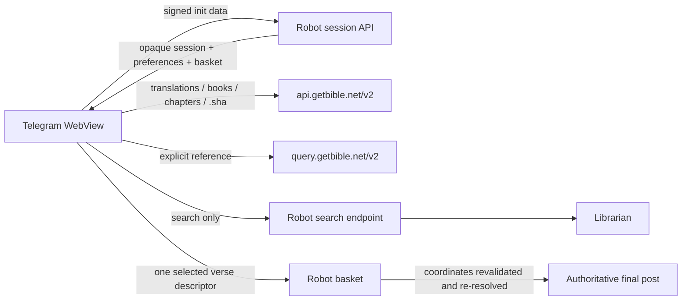
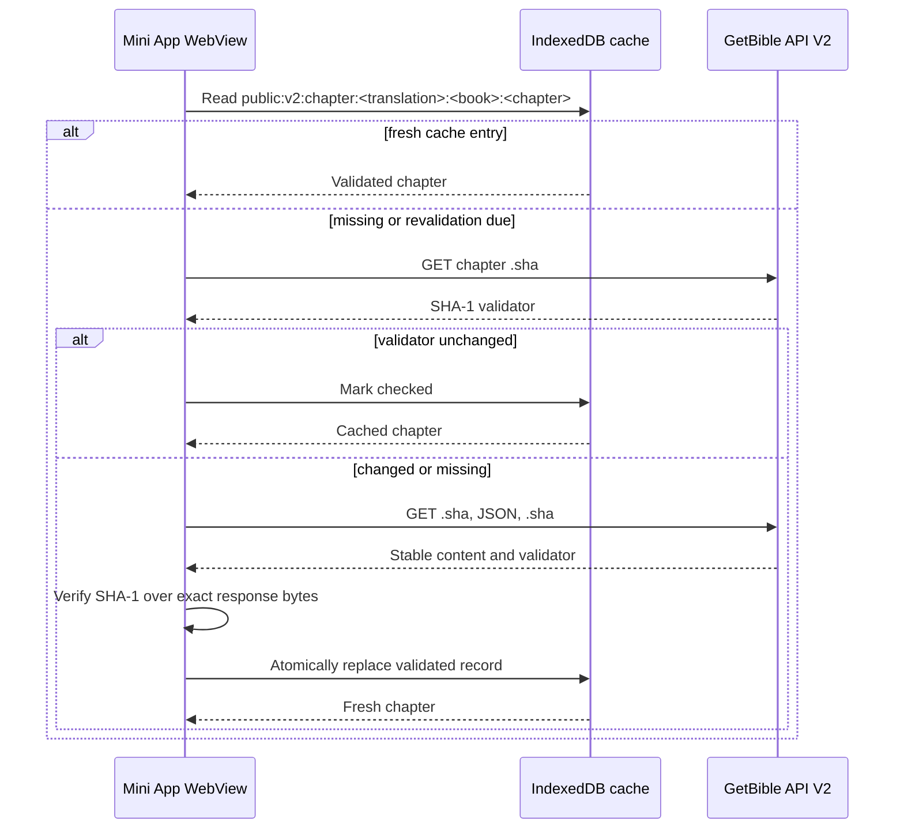

# Browser data architecture

The Telegram Mini App is a browser application. Public Bible content therefore belongs in the browser data plane rather than in the robot process. This keeps reading available when the robot is under load and prevents repeated chapter navigation from consuming robot sessions, rate-limit budget, or server memory.

## Ownership boundaries

| Capability | Browser / public GetBible API | Robot control plane | Librarian |
| --- | --- | --- | --- |
| Translation catalog | Yes | No | No |
| Book catalog | Yes | No | No |
| Chapter catalog | Yes | No | No |
| Chapter text | Yes | No | No |
| `/bible` reference resolution | Yes, Query API | No | No |
| Search and search pagination | No | Authenticated transport | Yes |
| Telegram authentication | No | Yes | No |
| User preferences | No | Yes | No |
| Selection basket metadata | No | Yes | No |
| Final Telegram posting | No | Yes | No |

The authenticated robot endpoints for translations, books, chapters, and scripture remain temporarily available for older deployed Mini App assets. Current assets do not call them. They are compatibility routes, not the primary data plane.

## Request flow

A normal read does not pass through the robot:

## Public API origins

The browser transport has two fixed HTTPS origins:

- `https://api.getbible.net/v2/` for mappings, Scripture, and matching `.sha` resources;
- `https://query.getbible.net/v2/` for explicit Bible-reference resolution.

The Content Security Policy allows only these two external connection origins in addition to the Mini App's own origin. The transport omits credentials, disables redirects, sends no Telegram data, and applies `no-referrer` and `no-store` request semantics.

## Persistent cache

Public GetBible content is stored in IndexedDB under the versioned `public:v2:` namespace. An in-memory implementation is used only when IndexedDB is unavailable or fails.

The cache is deliberately bounded:

- 160 records;
- 32 MiB total estimated JSON payload size;
- 2 MiB per record;
- least-recently-used eviction;
- in-flight request coalescing so concurrent views share one download.

Only public, identity-free payloads may enter this cache. Telegram init data, session tokens, user IDs, preferences, search terms/results, basket contents, and posting state are never written to it.

### Revalidation and invalidation

Every cached scope is revalidated at least once every seven days. A matching scope `.sha` keeps the cached payload and advances only its checked time. A changed translation hash invalidates cached book descendants; a changed book hash invalidates chapter mappings and chapter descendants. A changed chapter hash replaces only that chapter.

Chapter JSON is accepted only after all of the following are true:

1. the validator before and after retrieval is identical;
2. SHA-1 over the exact response bytes equals that validator;
3. the response passes bounded schema and request-coordinate validation.

A failed validation cannot overwrite a previously accepted record. An overdue entry is not silently treated as current when revalidation cannot be completed.

## Selection trust model

Verses rendered from the public API have deterministic browser identities derived from translation, book, chapter, and verse coordinates. These identities are for UI correlation; they are not trusted posting authority.

When a reader selects a verse, the browser sends one bounded descriptor to the authenticated basket endpoint. The robot retains only selected verses and Librarian search results. It no longer retains every verse of every chapter a user opens.

Before posting, the robot:

1. looks up each selected translation and book from its authoritative service;
2. validates the chapter and verse coordinates;
3. rebuilds the canonical reference from authoritative catalog data;
4. resolves the grouped references again;
5. posts the authoritative Scripture returned by the service.

Browser-supplied text, book names, references, and deterministic IDs can therefore affect only the temporary selection display. They cannot determine the final Scripture posted to Telegram.

## Failure behaviour

- Fresh validated cache entries continue to serve normal reads without a network call.
- A public API timeout or malformed response produces a retryable reading error and never invalidates the Telegram session.
- Query API failure falls back to local book/chapter parsing when the reference can still be resolved safely.
- Search failure remains isolated to the Librarian-backed search route.
- Basket and post failures remain isolated to authenticated robot control-plane operations.

## Deployment requirements

A deployment must serve both CSP declarations with the public API allowlist:

- the `Content-Security-Policy` meta element in `miniapp/index.html`;
- the `Content-Security-Policy` response header in `MiniAppStaticHandler`.

Deploy the HTML, JavaScript modules, and server code atomically. Static assets continue to revalidate through ETags so a Telegram WebView cannot combine a new shell with stale JavaScript.

## Verification

The release gate must prove:

- public catalog and chapter calls never use authenticated robot data routes;
- only search calls the Librarian-backed search endpoint;
- cache namespace and capacity bounds are enforced;
- exact-byte checksum mismatch is rejected;
- scope changes invalidate descendants;
- public API HTTP errors do not clear Telegram authentication;
- direct selections retain only one verse server-side;
- final posting reconstructs and validates authoritative references;
- both CSP layers contain the same fixed-origin allowlist;
- browser navigation works after a cold load and from a warm persistent cache.
