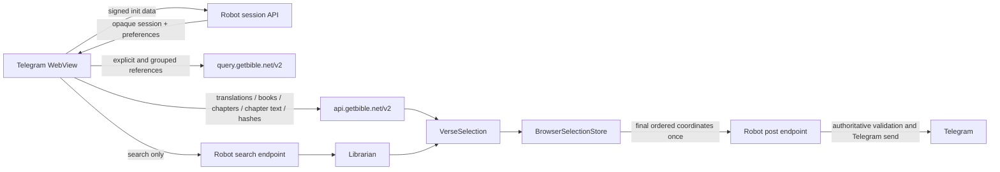

# Browser data architecture

The Telegram Mini App is a browser application. Public Bible content and temporary selection state therefore belong in the browser data plane rather than in the Robot process. This keeps reading responsive, avoids repeated server work, and isolates user interaction from Robot availability.

## Doctrine

Only full-text search and search pagination use Robot/Librarian.

Everything else in the reading experience is browser-owned and backed by GetBible API V2:

- `api.getbible.net/v2` supplies translation catalogs, books, chapter maps, chapter text, and hashes;
- `query.getbible.net/v2` supplies explicit and grouped reference resolution;
- IndexedDB stores validated public content;
- browser memory owns the current ordered selection;
- Robot authenticates Telegram, stores preferences, accepts the final ordered post request, validates it, and sends the authoritative Scripture to Telegram.

## Ownership boundaries

| Capability | Browser / GetBible API | Robot | Librarian |
| --- | --- | --- | --- |
| Translation catalog | Yes | No | No |
| Book catalog | Yes | No | No |
| Chapter catalog | Yes | No | No |
| Chapter text | Yes | No | No |
| Explicit/grouped references | Yes, Query API | No | No |
| Full-text search | No | Authenticated transport | Yes |
| Search pagination | No | Authenticated transport | Yes |
| Selection highlighting | Yes | No | No |
| Select/unselect/reorder/clear | Yes | No | No |
| Telegram authentication | No | Yes | No |
| User preferences | No | Yes | No |
| Final Telegram posting | Coordinates submitted once | Yes | No |

## Request flow



No select, unselect, reorder, clear, reader navigation, catalog, chapter, or explicit-reference operation may call Robot.

## Shared verse contract

Reader verses and Librarian search results are normalized into the same `VerseSelection` interface:

```text
selection_id   Stable UI identity
translation    Translation code
reference      Display reference
book_number    Canonical book number
book_name      Display book name
chapter        Positive chapter number
verse          Positive verse number
text           Browser display text
terms          Optional search metadata
highlights     Optional search highlights
```

Coordinate identity is `translation + book_number + chapter + verse`. Transport-specific tokens are not identity. A verse selected from search must appear selected when the same verse is opened in the reader, and vice versa.

## Browser selection lifecycle

1. A reader chapter or Librarian search response produces `VerseSelection` records.
2. The browser selection store adds or removes records by coordinate identity.
3. The UI derives `aria-pressed`, highlight styling, range boundaries, counters, copy output, and ordering from that store.
4. No Robot request occurs while the selection changes.
5. Post submits the final ordered coordinates once.
6. Robot resolves authoritative Scripture before sending it to Telegram.
7. A failed Post leaves browser state intact; a successful Post clears it.

Browser text, names, and references are display data only and never posting authority.

## Public API origins

The browser transport has two fixed HTTPS origins:

- `https://api.getbible.net/v2/` for mappings, Scripture, and matching `.sha` resources;
- `https://query.getbible.net/v2/` for explicit and grouped Bible-reference resolution.

The Content Security Policy allows only these two external connection origins in addition to the Mini App origin. Requests omit credentials, disable redirects, send no Telegram data, use `no-referrer`, and do not rely on HTTP cache state.

### Waiting for a chapter

A chapter is downloaded, not computed, so the only question a deadline can honestly ask is whether the response is still arriving. The transport bounds a read by inactivity: the stall timer is rearmed by every chunk of body, so a transfer that is still progressing is never abandoned for taking a long time, however slow the connection or however long the chapter. A second, much larger bound exists only so a connection that trickles forever cannot hold a request open without end.

A single wall clock over the whole read asked the wrong question and answered it wrongly on a slow phone: it abandoned transfers that were progressing and told the reader Scripture could not be loaded, when it was still coming.

Reads that fail for a reason that may not repeat — a stalled transfer, a dropped connection, a 429 or 5xx — are retried a bounded number of times with exponential backoff. A refusal that will repeat — a 404, an oversized body, a malformed payload, a checksum mismatch — is raised on the first attempt and never retried.

## Persistent cache

Public GetBible content is stored in IndexedDB under the versioned `public:v2:` namespace. An in-memory implementation is used only when IndexedDB is unavailable.

The cache is bounded by record count, total estimated payload size, per-record size, least-recently-used eviction, and in-flight request coalescing. Only identity-free public payloads may enter this cache. Telegram init data, session tokens, user IDs, preferences, search results, selections, and posting state are excluded.

### Revalidation and invalidation

Every cached scope is revalidated at least weekly. A changed translation hash invalidates book descendants; a changed book hash invalidates chapter descendants; a changed chapter hash replaces that chapter. Chapter JSON is accepted only when the pre-read and post-read hashes match, SHA-1 over the exact bytes matches that hash, and the payload passes bounded schema and coordinate validation.

A failed validation never replaces a previously accepted record.

## Failure isolation

- A public API failure affects reading only and never invalidates Telegram authentication.
- A Librarian failure affects search only.
- A browser selection operation cannot fail because Robot is unavailable.
- A failed final Post preserves the complete ordered browser selection for retry.
- A malformed or tampered final selection is rejected by Robot before Telegram output.

## Compatibility and removal policy

Legacy Robot endpoints for translations, books, chapters, Scripture reads, and per-click basket mutation are deprecated compatibility surfaces. Current Mini App assets must not call them. Once the supported mixed-version deployment window ends, those routes, tests, documentation, and dormant helpers must be removed together in one release.

No documentation or test may present legacy routes as the active design.

## Verification

The release gate must prove:

- catalog, chapter, and explicit/grouped reference traffic goes directly to GetBible API;
- only full-text search and search pagination use Librarian;
- select, unselect, reorder, and clear issue no Robot request;
- reader and search records share coordinate identity;
- selected verses remain highlighted after chapter navigation and source changes;
- a second click unselects immediately;
- final Post submits one ordered selection payload and preserves state on failure;
- Robot re-resolves authoritative Scripture before Telegram output;
- cache hashes, bounds, invalidation, and CSP origin parity remain enforced;
- cold and warm real-browser flows pass.
