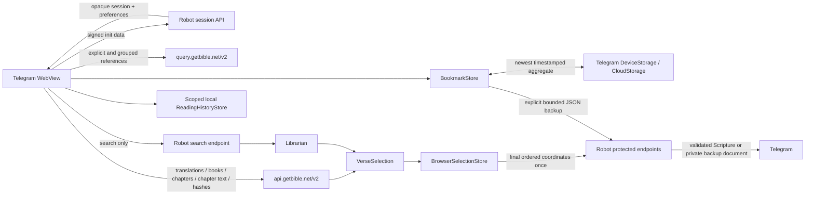

# Browser data architecture

The Telegram Mini App is a browser application. Public Bible content, temporary selection state, and device-local reading history therefore belong in the browser data plane rather than in the Robot process. Small user-critical records additionally reconcile with Telegram Mini App storage, while large public catalogs and chapters remain browser-only. This keeps reading responsive, avoids repeated server work, and preserves useful cross-device continuity without making ordinary reading depend on Robot.

## Doctrine

Only full-text search and search pagination use Librarian. Robot also provides
the authenticated control paths for sessions, preferences, final Post, and an
explicit bookmark chat backup or restore.

The reading and persistence split is:

- `api.getbible.net/v2` supplies translation catalogs, books, chapter maps, chapter text, and hashes;
- `query.getbible.net/v2` supplies explicit and grouped reference resolution;
- IndexedDB stores validated public content;
- browser memory owns the current ordered selection;
- scoped browser `localStorage` owns bounded, coordinate-only reading history;
- scoped `localStorage` plus Telegram `DeviceStorage` and `CloudStorage` reconcile
  personal bookmark aggregate v2, colored topics, the active topic, and compact
  last-read coordinates;
- scoped browser `localStorage` plus Telegram `DeviceStorage` reconcile
  device-local global-catalog visibility, per-link exclusions, and legacy
  topic mapping; `CloudStorage` is excluded;
- Robot authenticates Telegram, retains compatible reader preferences, accepts
  the final ordered post request, validates it, and sends authoritative
  Scripture or an explicitly requested bookmark backup document to Telegram.

## Ownership boundaries

| Capability | Browser / GetBible API | Robot | Librarian |
| --- | --- | --- | --- |
| Translation catalog | Yes | No | No |
| Book catalog | Yes | No | No |
| Chapter catalog | Yes | No | No |
| Chapter text | Yes | No | No |
| Explicit/grouped references | Yes, Query API | No | No |
| Full-text search | No | Authenticated transport | Yes |
| Search pagination | No | Authenticated transport | Yes |
| Selection highlighting | Yes | No | No |
| Select/unselect/reorder/clear | Yes | No | No |
| Reading history record/remove/clear | Yes | No | No |
| Bookmark/topic editing and local import/export | Yes | No | No |
| Bookmark and last-read device/cloud sync | Telegram Mini App storage | No | No |
| Global catalog visibility and exclusions | Scoped localStorage + Telegram DeviceStorage | No | No |
| Private-chat bookmark backup/restore transport | Confirm/merge in browser | Yes | No |
| Telegram authentication | No | Yes | No |
| Reader preference compatibility | Compact Mini App storage copy | Yes | No |
| Final Telegram posting | Coordinates submitted once | Yes | No |

## Request flow



No select, unselect, reorder, clear, reader navigation, catalog, chapter, or explicit-reference operation may call Robot.

## Reading history

Every successfully opened chapter records its target verse, and every
successfully added selection records that verse. Chapter visits de-duplicate by
book and chapter; selections de-duplicate by their book/chapter/verse
coordinate across translations, and an exact coordinate also coalesces across
event kinds.
Recording a repeat updates and promotes that entry instead of duplicating it.
Each entry contains only its translation, display reference, book name/number,
chapter, verse, event kind, local identifier, and visit time. The store never
persists a verse body, Telegram identity, launch data, session token, search
result, or preference.

The versioned record is unique, newest-first, bounded to 1,000 entries, and
stored under a key derived from the authenticated user scope in browser
`localStorage`. Legacy cross-translation duplicates are compacted when
restored. The History page progressively hydrates initial and near-viewport
display-only verse excerpts from the same bounded public chapter data plane
used by global Bookmarks. Missing coordinates render a localized unavailable
state; transient chapter failures remain request failures and retry after the
browser reconnects. Excerpts are not added to the history record. The reader
reopens the exact coordinate in the currently selected translation, can remove
one entry, or clear the entire record. Clearing removes the storage key. If `localStorage` is
unavailable, history remains available in memory until the page closes.

History never reconciles through Telegram storage and never reaches Robot.
Moving between devices therefore synchronizes personal bookmarks and last-read, but not
the device's trail of previously opened locations.

## Hybrid user storage

The hybrid adapter is intentionally limited to compact personal data:

- at most 100 colored bookmark topics and 800 canonical whole-verse records;
- multiple topic identifiers per verse record, without consuming another verse
  slot;
- the active bookmark topic;
- a last-read record containing only translation, book, chapter, verse,
  version, and update timestamp, or a timestamped cleared marker without a
  coordinate.

The personal bookmark aggregate is stored immediately in the authenticated user's
scoped `localStorage` record. At startup, valid local, Telegram
`DeviceStorage`, and Telegram `CloudStorage` candidates are compared by update
time; the newest candidate becomes active and is mirrored to every available
store. Later writes update the local copy synchronously and coalesce bounded
Telegram writes in the background. A client without either Telegram API keeps
working from local storage and presents sync as degraded instead of blocking
the feature. Aggregate version 2 stores full topic identifiers locally and in
DeviceStorage; CloudStorage uses compact topic indexes into the topic manifest
and reconstructs the identifiers when reading.

Bookmark identity is canonical book/chapter/verse, not translation. Assigning
the same verse from another translation updates its one record. Assigning it to
another topic extends that record, while repeating an existing assignment is a
no-op. Removing a topic warns before removing that topic's personal assignments.
Built-in topic names come from localized constants and cannot be renamed;
users may recolor or remove them. Custom topics remain user-named and editable.
Restoring default tags recreates only missing definitions, preserving recolors,
custom topics, and personal bookmarks. Selections remain independent
and ephemeral, and the public cache remains identity-free.

### Global catalog overlay

The browser bundle provides 2,155 global verse links across 61 topics. They
appear in the same topic list as personal records and carry a **G** marker.
Their cards hydrate verse text for the currently selected translation from the
bounded public chapter data plane; that text is not persisted as a bookmark.
Compact **Add all** and **Remove all** controls precede topic search; per-topic
add/remove and per-link hiding remain available. Topic visibility, exclusions,
and canonical mapping for renamed legacy numeric topics are timestamped under
the hashed account scope and reconciled between browser `localStorage` and
Telegram `DeviceStorage`. This restores the selection when a Telegram Desktop
WebView discards its browser storage while keeping the state device-local:
`CloudStorage` is never read or written. Loading one topic or the full catalog
restores its hidden links without duplication. Global links and these
preferences never enter the personal aggregate or backup documents.

The provider boundary leaves room for a future authorized publishing source,
but authorized-user global publishing is intentionally not implemented.

### Portable recovery

The Bookmarks page can download and merge a bounded personal JSON file. New
documents are version 4 and represent multi-topic assignment with bounded
`colorIndexes` into the color array; version 1, 2, and 3 documents remain
importable. The page can also send the
validated JSON to the authenticated user's private bot chat.
That document has an owner-bound Restore callback that remains useful on
another Telegram client. Pressing it in the owner's private chat creates a
fresh short-lived, one-time Mini App launch containing only bounded Telegram
file metadata. The browser retrieves the document, asks the user to confirm,
merges and flushes it, then acknowledges the restore reference. The document
message remains in chat for future recovery. Robot does not store or log the
backup body in a database or Mini App session.

## Shared verse contract

Reader verses and Librarian search results are normalized into the same `VerseSelection` interface:

```text
selection_id   Stable UI identity
translation    Translation code
reference      Display reference
book_number    Canonical book number
book_name      Display book name
chapter        Positive chapter number
verse          Positive verse number
text           Browser display text
terms          Optional search metadata
highlights     Optional search highlights
```

Coordinate identity is `translation + book_number + chapter + verse`. Transport-specific tokens are not identity. A verse selected from search must appear selected when the same verse is opened in the reader, and vice versa.

## Browser selection lifecycle

1. A reader chapter or Librarian search response produces `VerseSelection` records.
2. The browser selection store adds or removes records by coordinate identity.
3. The UI derives `aria-pressed`, highlight styling, range boundaries, counters, copy output, and ordering from that store.
4. No Robot request occurs while the selection changes.
5. Post submits the final ordered coordinates once.
6. Robot resolves authoritative Scripture before sending it to Telegram.
7. A failed Post leaves browser state intact; a successful Post clears it.

Browser text, names, and references are display data only and never posting authority.

## Public API origins

The browser transport has two fixed HTTPS origins:

- `https://api.getbible.net/v2/` for mappings, Scripture, and matching `.sha` resources;
- `https://query.getbible.net/v2/` for explicit and grouped Bible-reference resolution.

The Content Security Policy allows only these two external connection origins in addition to the Mini App origin. Requests omit credentials, disable redirects, send no Telegram data, use `no-referrer`, and do not rely on HTTP cache state.

### Waiting for a chapter

A chapter is downloaded, not computed, so the only question a deadline can honestly ask is whether the response is still arriving. The transport bounds a read by inactivity: the stall timer is rearmed by every chunk of body, so a transfer that is still progressing is never abandoned for taking a long time, however slow the connection or however long the chapter. A second, much larger bound exists only so a connection that trickles forever cannot hold a request open without end.

A single wall clock over the whole read asked the wrong question and answered it wrongly on a slow phone: it abandoned transfers that were progressing and told the reader Scripture could not be loaded, when it was still coming.

Reads that fail for a reason that may not repeat — a stalled transfer, a dropped connection, a 429 or 5xx — are retried a bounded number of times with exponential backoff. A refusal that will repeat — a 404, an oversized body, a malformed payload, a checksum mismatch — is raised on the first attempt and never retried.

## Persistent cache

Public GetBible content is stored in IndexedDB under the versioned `public:v2:` namespace. An in-memory implementation is used only when IndexedDB is unavailable.

The cache is bounded by record count, total estimated payload size, per-record
size, least-recently-used eviction, and in-flight request coalescing. Only
identity-free public payloads may enter this cache. Telegram init data, session
tokens, user IDs, preferences, search results, selections, reading history,
bookmarks, last-read records, and posting state are excluded. History and the
hybrid bookmark adapter use separate bounded scoped stores and never enter the
public cache.

### Revalidation and invalidation

Every cached scope is revalidated at least weekly. A changed translation hash invalidates book descendants; a changed book hash invalidates chapter descendants; a changed chapter hash replaces that chapter. Chapter JSON is accepted only when the pre-read and post-read hashes match, SHA-1 over the exact bytes matches that hash, and the payload passes bounded schema and coordinate validation.

A failed validation never replaces a previously accepted record.

## Failure isolation

- A public API failure affects reading only and never invalidates Telegram authentication.
- A Librarian failure affects search only.
- A browser selection operation cannot fail because Robot is unavailable.
- A failed final Post preserves the complete ordered browser selection for retry.
- A malformed or tampered final selection is rejected by Robot before Telegram output.
- Telegram storage failure degrades bookmark/last-read sync to whichever valid
  local or Telegram store remains available; it does not invalidate Scripture
  content, history, or selection.
- A chat restore transport, validation, or confirmation failure before merge
  leaves current bookmarks unchanged. If persistence or acknowledgement fails
  after merge, the imported merge remains available and the chat document can
  be retried. Local JSON download/import remains independent of chat transport.

## Compatibility and removal policy

Legacy Robot endpoints for translations, books, chapters, Scripture reads, and per-click basket mutation are deprecated compatibility surfaces. Current Mini App assets must not call them. Once the supported mixed-version deployment window ends, those routes, tests, documentation, and dormant helpers must be removed together in one release.

No documentation or test may present legacy routes as the active design.

## Verification

The release gate must prove:

- catalog, chapter, and explicit/grouped reference traffic goes directly to GetBible API;
- only full-text search and search pagination use Librarian;
- select, unselect, reorder, and clear issue no Robot request;
- reader and search records share coordinate identity;
- selected verses remain highlighted after chapter navigation and source changes;
- a second click unselects immediately;
- final Post submits one ordered selection payload and preserves state on failure;
- Robot re-resolves authoritative Scripture before Telegram output;
- cache hashes, bounds, invalidation, and CSP origin parity remain enforced;
- cold and warm real-browser flows pass;
- successful chapter opens and selections record unique scoped, durable local
  history, promoting revisited coordinates to the front;
- History remains available from every bottom-navigation surface, restores
  translation and coordinates, supports individual removal, and fully resets;
  opening the History page, recording, removal, and reset issue no Robot
  request. Restoring an entry may persist the normal reader preference, but
  uses no history or Scripture-content route;
- bookmark topic operations, canonical cross-translation deduplication,
  multi-topic assignment within the 800-record bound, v4 export with v1/v2/v3
  import, and aggregate-v2 reconciliation with compact cloud topic indexes
  remain deterministic under partial API failure;
- the unified global/personal list, **G** marker, per-link hide, and
  per-topic/all-catalog reset remain browser-local and absent from personal
  sync and backup;
- private-chat backup is owner-bound and bounded, restore uses a fresh
  one-time launch, the confirmed merge persists before acknowledgement, and no
  backup body enters Robot database/session/log storage.
